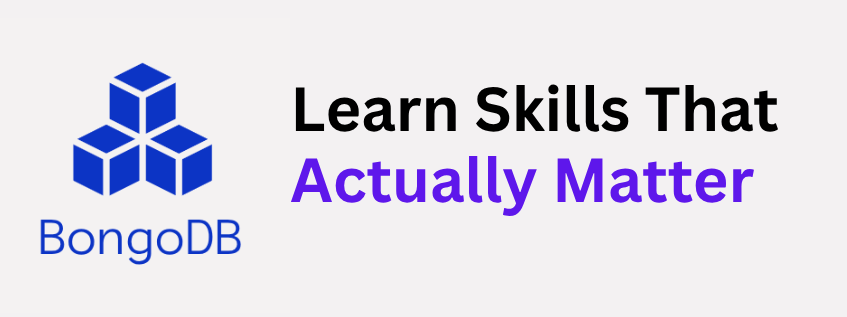

<div align="center">
  <a href="https://dbms-bongodb.vercel.app/">
      
  </a>
</div>
<p align="center">
    <br>
    <a href="#getting-started">Getting Started</a> |
    <a href="#database-design">Database Design</a> |
    <a href="#technology-stack--deployment">Tech Stack used</a> |
    <a href="https://github.com/suvadipbhuiya2004/dbms-project1/blob/main/docs/LabAssignment-4.pdf">Problem Statement</a> |
    <a href="https://github.com/suvadipbhuiya2004/dbms-project1/blob/main/docs/Report.pdf">Report</a>
</p>


# Simple Query Processor

A lightweight SQL engine in C++ with parser, planner, optimizer, and executor layers.

Architecture flow:

```text
SQL -> Lexer + Parser -> AST -> Planner -> Optimizer -> Executors
```

## Build and Run

```bash
make build        # Compile
make run          # Run queries.sql
make start-cli    # Start interactive SQL terminal
make test         # Run unit tests
make test-verbose # Verbose unit tests
make rebuild      # Clean and rebuild
make clean        # Remove build artifacts
```

### Terminal CLI Modes

REPL supports SQL plus useful non-SQL meta commands:

- Built-in line editor (no extra install required)
- Arrow-up / arrow-down command history (persisted across sessions)
- Arrow-up recalls the full previous SQL statement (not fragmented lines)
- Direct multi-line paste support for SQL blocks

- `.help` show command help
- `.tables` list loaded tables with row and column counts
- `.schema <table>` print schema and constraints
- `.run <file.sql>` execute SQL file from inside REPL
- `.clear` clear the terminal screen
- `.quit` or `.exit` close REPL

## Project Data Files

- Metadata catalog: data/metadata.json
- Table data: data/*.csv
- SQL workload: queries.sql

## metadata.json Structure

Top-level shape:

```json
{
	"tables": {
		"<table_name>": {
			"file": "<table_file>.csv",
			"columns": [
				{
					"name": "<column_name>",
					"type": "<type>",
					"primary_key": true,
					"unique": true,
					"not_null": true,
					"foreign_key": "<ref_table>.<ref_column>",
					"check": { "type": "enum", "values": ["A", "B"] }
				}
			],
			"table_checks": [
				"<sql_boolean_expression>"
			]
		}
	}
}
```

Column field meanings:
- name: column name
- type: normalized SQL type string (for example INT, VARCHAR(50), TIMESTAMP)
- primary_key: marks column as part of primary key
- unique: unique constraint
- not_null: disallow empty value
- foreign_key: reference in table.column format
- check: column-level validation rule

Supported check object formats:

```json
{ "type": "enum", "values": ["ok", "warn", "fail"] }
```

```json
{ "type": "range", "min": 0, "max": 100 }
```

```json
{ "type": "comparison", "operator": ">", "value": 0 }
```

```json
{ "type": "expression", "sql": "score >= 0 AND score <= 100" }
```

Notes:
- table_checks is optional.
- Legacy string check values are still readable, but object format is preferred.
- CREATE TABLE and ALTER TABLE keep metadata.json in sync with table schema.

## Methodology

For a simple explanation of how this engine works, query execution paths, and the overall architecture, see the [Project Methodology](./docs/methodology.md) document.

## Web Architecture Extension

If you want to add a web-based terminal on top of this C++ query processor, check out the [Web Architecture Guide](./docs/web-architecture.md). It outlines the recommended approach for building a decoupled frontend and backend API while keeping the engine as the execution core.

## More Details

See [Features](docs/features.md) for what more features support
